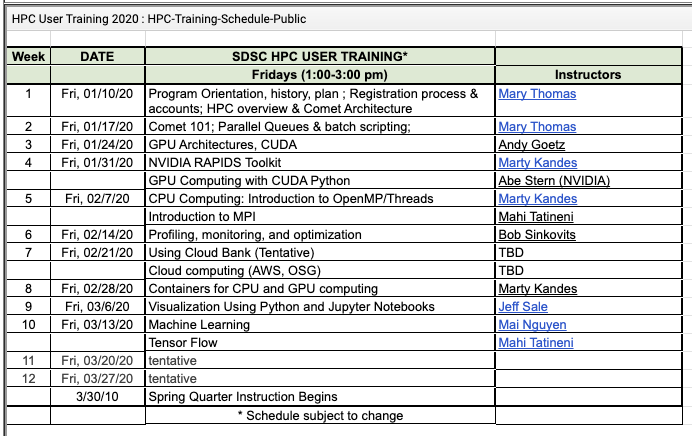

# SDSC HPC User Training:  Winter, 2020
Repository for HPC Training Materials (lectures, code, etc.)

### 2020 HPC Training Schedule:
Current Schedule (Jan 31, 2020):

Click here for latest schedule:
[https://hpc-students.sdsc.edu/hpc-training-sched-2020.html](https://hpc-students.sdsc.edu/hpc-training-sched-2020.html)

## Overview
SDSC is offering a 10 week HPC Training for UCSD undergraduate and graduate students. The training will consist of a series of sessions, to be held weekly at SDSC. Students will give accounts on Comet, the SDSC Supercomputer, and be given the opportunity to complete several basic assignments. Students who successfully complete the HPC Training program will receive an SDSC Certificate of Completion in HPC Training, and will become eligible to apply to be on the SCC Core team. Note: the final SCC team who will travel to the competition will be chosen from this group.

This year the sessions will be held on Fridays from 1:00pm to 3:00pm in the SDSC SynCenter, or the Auditorium, depending on attendance.

## Course Preparation:
Check out our basic skill-building and preparation tutorials needed for this course [https://github.com/sdsc-hpc-training/basic_skills](https://github.com/sdsc-hpc-training/basic_skills)

## To learn more, see [https://hpc-students.sdsc.edu](https://hpc-students.sdsc.edu)
